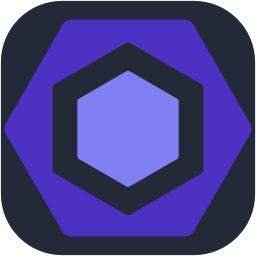
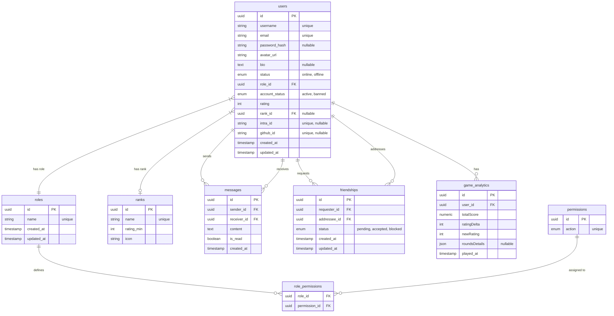

_This project has been created as part of the 42 curriculum by ade-woel, gde-win, juhanse, mmichele and sdemey._

# ft_transcendance

<!-- TODO : Update TOC -->

- [Description](#description)
- [Instruction](#instruction)
	- [Prerequisites](#prerequisites)
	- [Installation \& Execution](#installation--execution)
	- [Useful Commands](#useful-commands)
	- [Environment variables](#environment-variables)
- [Ressources](#ressources)
	- [References](#references)
	- [Usage of AI](#usage-of-ai)
- [Team information](#team-information)
- [Project management](#project-management)
	- [Development](#development)
	- [Tools and infrastructure](#tools-and-infrastructure)
	- [Communication channels](#communication-channels)
- [Technical stack](#technical-stack)
- [Database schema](#database-schema)
	- [Entity-Relationship Diagram](#entity-relationship-diagram)
	- [Transient Data (Non-DB)](#transient-data-non-db)
- [Feature list](#feature-list)
- [Modules](#modules)
- [Individual contribution](#individual-contribution)
	- [`ade-woel`](#ade-woel)
	- [`gde-win`](#gde-win)
	- [`juhanse`](#juhanse)
	- [`mmichele`](#mmichele)
	- [`sdemey`](#sdemey)

## Description

<p align="center"></p>

**Who's the Chad ?** is an interactive social platform, that allows users to 
discuss and play primitive minigames, around knowledge and reflection.

## Instruction

### Prerequisites

- [Docker](https://docs.docker.com/get-docker/) must be installed on your machine.
- `make` must be available.

### Installation & Execution

To start the project, simply clone the repository and run `make`:

```bash
git clone <repository-url>
cd chadscendence
make
```

This command will:

1. Copy `.env.example` to `.env` if it doesn't exist.
2. Build the Docker images.
3. Start the application in a development environment with hot-reloading (via bind mounts).

**Access the application:**

- Frontend: `https://localhost` (Nginx)
- Backend API: `http://localhost:3000` (NestJS)

### Useful Commands

| Command        | Description                              |
| -------------- | ---------------------------------------- |
| `make help`    | Show available commands.                 |
| `make`         | Start the project (alias for `make up`). |
| `make up`      | Start services in detached mode.         |
| `make build`   | Build or rebuild images.                 |
| `make down`    | Stop and remove containers.              |
| `make start`   | Start stopped containers.                |
| `make stop`    | Stop running containers.                 |
| `make restart` | Restart containers.                      |
| `make status`  | Check container status.                  |
| `make logs`    | Follow container logs.                   |
| `make re`      | Full clean and restart.                  |
| `make fclean`  | Deep clean (removes images and volumes). |
| `make sprune`  | Deep clean and system prune.             |
| `make ci`      | Run local CI checks (lint, test, build). |


### Environment variables

An `.env` file must be created at the root of the repository containing the necessary environment variables, for the project.
These are detailed in the [.env.example](.env.example) file.

## Ressources

### References

| Technology / Framework | Subject                                                                                              | Author                                                 |
| ---------------------- | ---------------------------------------------------------------------------------------------------- | ------------------------------------------------------ |
| NestJS                 | [Official Documentation](https://docs.nestjs.com/)                                                   |                                                        |
| "                      | [Every Concept Explained in 9 Minutes](https://www.youtube.com/watch?v=IdsBwplQAMw)                  | [Tech Vision](https://www.youtube.com/@tech-vision-io) |
| "                      | [Crash Course: Learn in 25 Minutes](https://www.youtube.com/watch?v=2gtiffE3__U)                     | "                                                      |
| "                      | [Microservices](https://www.youtube.com/watch?v=I8cs8fJYF_w)                                         | "                                                      |
| "                      | [Authentication](https://www.youtube.com/watch?v=i-howKMrtCM)                                        | "                                                      |
| "                      | [Course for Beginners - Build Server-Side Applications](https://www.youtube.com/watch?v=21_I-12f5JE) | [freeCodeCamp](https://www.freecodecamp.org/)          |
| Tailwind CSS           | [Official Documentation](https://tailwindcss.com/docs/installation/using-vite)                       |                                                        |
| TypeScript             | [Official Documentation](https://www.typescriptlang.org/docs/)                                       |                                                        |
| React                  | [Official Documentation](https://react.dev/)                                                         |                                                        |

### Usage of AI

- Builtin GitHub, copilot for pull request reviews, and pull request messages.

## Team information

| Member     | Role            | Responsibilities                                                                                  |
| ---------- | --------------- | ------------------------------------------------------------------------------------------------- |
| `ade-woel` | Project Manager | Ensuring recuring meetings and orcherstrating them.                                               |
| `gde-win`  | Technical Lead  | Maintaining the infrastructure, dependencies, and CI/CD pipelines.                                |
| `juhanse`  | Product Owner   | Maintaining clear objectives for the project, via GitHub issues mapped into kanbans and roadmaps. |
| `mmichele` |                 |                                                                                                   |
| `sdemey`   |                 |                                                                                                   |

Every member is also developer, so responsible of programming features.

## Project management

### Development

At least one meeting was done each week.  
The first meeting used to determine the roles of each member and the global idea of the project.  
The other ones to keep track of what requirements were left and assign members to it.

### Tools and infrastructure

On GitHub we used integrated CI/CD pipelines, to ensure that the code on the main branch was always respecting our coding convention, running correctly and passing all possible tests.

### Communication channels

At first we used a Slack group, which felt not versatile enough to organize ourselves, so we moved to a Discord server, using the following features ;

- it's built-in event calendar to publish meeting apointements,
- voice and stage channels for day-to-day working and meetings,
- forum channels to save important ressources,
- an automated announcement channel using a GitHub webhook, announcing important updates of the project,
- and obviously a text channel and threads for textual communication and topic filtering.

## Technical stack

<!-- TEMPLATE : <a href="" title=""></a> -->

|              | Frameworks / Technologies                                                                                                                                                                                                                                                                                                                                                                                                                                                                                                                                                                                                                 |
| :----------: | ----------------------------------------------------------------------------------------------------------------------------------------------------------------------------------------------------------------------------------------------------------------------------------------------------------------------------------------------------------------------------------------------------------------------------------------------------------------------------------------------------------------------------------------------------------------------------------------------------------------------------------------- |
| **Frontend** | <a href="https://www.typescriptlang.org/" title="TypeScript"></a> <a href="https://react.dev/" title="React"></a> <a href="https://vite.dev/" title="Vite"></a> <a href="https://tailwindcss.com/" title="Tailwind"></a>                                                                                                                                                                                                                   |
| **Backend**  | <a href="https://www.typescriptlang.org/" title="TypeScript"></a> <a href="https://nestjs.com/" title="NestJS"></a>                                                                                                                                                                                                                                                                                                                                                                                                                           |
| **Database** | <a href="https://www.postgresql.org/" title="PostgreSQL"></a> <a href="https://typeorm.io/" title="TypeORM"></a>                                                                                                                                                                                                                                                                                                                                                                                                |
|  **Other**   | <a href="https://www.markdownguide.org/" title="Markdown"></a> <a href="https://www.docker.com/" title="Docker"></a> <a href="https://nodejs.org/en" title="NodeJS"></a> <a href="https://www.npmjs.com/" title="NPM"></a> <a href="https://eslint.org/" title="ESLint"></a> <a href="https://krita.org/en/" title="Krita"></a> |

- **TypeScript** on both frontend and backend enables shared types, safer refactors, and fewer runtime errors.
- **React** + **Vite** provide a fast development loop with component-driven UI and instant feedback.
- **Tailwind CSS** accelerates UI iteration while keeping the design system consistent.
- **NestJS** offers a modular, test-friendly architecture with dependency injection and clear separation of concerns.
- **PostgreSQL** + **TypeORM** give a reliable relational model with migrations and strong data integrity.
- **Docker** ensures reproducible environments across local development, CI, and production.
- **Node.js** + **npm** keep tooling consistent and unlock a large ecosystem of libraries.
- **ESLint** enforces code quality and consistency accross contributors while helping to catch issues early.
- **Markdown** support clear documentation.
- **Krita** allows custom-made visual assets, while being a free software, so anyone can easily open `.kra` files.

## Database schema

This document describes the persistent data model for Chadscendence.

### Entity-Relationship Diagram



### Transient Data (Non-DB)

The following models exist in the application but are **not** persisted in the primary PostgreSQL database:

- **Active Games:** Managed in Redis for real-time performance.

## Feature list

<!-- TODO -->

| Role          | Feature                 | Details                                      | Contributors                               |
| ------------- | ----------------------- | -------------------------------------------- | ------------------------------------------ |
| Visitor       | Display language        | French                                       | [sdemey](#sdemey)                          |
| Visitor       | Display language        | English                                      | [sdemey](#sdemey)                          |
| Visitor       | Display language        | Dutch                                        | [sdemey](#sdemey)                          |
| Visitor       | About page              | Explains project objectives and contributors | [mmichele](#mmichele), [sdemey](#sdemey)   |
| Visitor       | Privacy Policy          | Explains privacy policy and terms of service | [sdemey](#sdemey)   |
| Visitor       | Home page               |                                              | [mmichele](#mmichele)                      |
| Visitor       | Register                | Create an account on the site                | [juhanse](#juhanse)                        |
| Visitor       | Login                   | Sign in to the site                          | [juhanse](#juhanse)                        |
| Visitor       | Authentication          | Login / Register with 42 OAuth               | [juhanse](#juhanse)                        |
| Visitor       | Authentication          | Login / Register with GitHub OAuth           | [sdemey](#sdemey)                          |
| Visitor       | Leaderboard             | View the global leaderboard                  | [mmichele](#mmichele)                      |
| Visitor       | Theme                   | Change the website color theme               | [mmichele](#mmichele)                      |
| User          | Social                  | See friends online in real time              | [juhanse](#juhanse)                        |
| User          | Social                  | Send private messages to friends             | [juhanse](#juhanse)                        |
| User          | Social                  | Search users and send friend requests        | [juhanse](#juhanse)                        |
| User          | Minigame                | ChadMathics (speed math calculations)        | [gde-win](#gde-win)                        |
| User          | Minigame                | Fast and FurChad (reaction time test)        | [ade-woel](#ade-woel)                      |
| User          | Minigame                | Create a minigame sequence                   | [sdemey](#sdemey)                          |
| User          | Ranking                 | Have a rank based on a rating                | [juhanse](#juhanse), [mmichele](#mmichele) |
| User          | Profile                 | User information                             | [ade-woel](#ade-woel)                      |
| User          | Profile                 | Game history                                 | [juhanse](#juhanse), [mmichele](#mmichele) |
| User          | Profile                 | Game statistics                              | [juhanse](#juhanse), [mmichele](#mmichele) |
| User          | Profile                 | Game statistics with filter presets          | [juhanse](#juhanse), [mmichele](#mmichele) |
| User          | Profile                 | Achievements                                 | [juhanse](#juhanse), [mmichele](#mmichele) |
| User          | Edit Profile            | Profile picture                              | [ade-woel](#ade-woel)                      |
| User          | Edit Profile            | Username                                     | [ade-woel](#ade-woel)                      |
| User          | Edit Profile            | Biography                                    | [ade-woel](#ade-woel)                      |
| User          | Edit Profile            | Password                                     | [ade-woel](#ade-woel)                      |
| User          | Profile                 | Visit other users profile                    | [juhanse](#juhanse)                        |
| Administrator | User Management         | Edit username                                | [ade-woel](#ade-woel)                      |
| Administrator | User Management         | Edit biography                               | [ade-woel](#ade-woel)                      |
| Administrator | User Management         | Edit rating                                  | [ade-woel](#ade-woel)                      |
| Administrator | User Management         | Edit profile picture                         | [ade-woel](#ade-woel)                      |
| Administrator | User Management         | Ban a user                                   | [ade-woel](#ade-woel)                      |
| Administrator | User Management         | Display all users                            | [juhanse](#juhanse)                        |
| Administrator | User Management         | Filter user search results                   | [juhanse](#juhanse)                        |
| Administrator | Roles & Permissions     | Create roles and associated permissions      | [juhanse](#juhanse)                        |

## Modules
| Module                                                                                       | Points | Justifications                                                                                               | How it has been implemented                                                                                                                                                                                                                                                                                                                                                                                                                                                        | Contributors                                                                                              |
| -------------------------------------------------------------------------------------------- | ------ | ------------------------------------------------------------------------------------------------------------ | ---------------------------------------------------------------------------------------------------------------------------------------------------------------------------------------------------------------------------------------------------------------------------------------------------------------------------------------------------------------------------------------------------------------------------------------------------------------------------------- | --------------------------------------------------------------------------------------------------------- |
| Use a framework for both the frontend and backend.                                           | Major  | Reduce development time, once the knowledge acquired and better architectural pattern.                       | With NPM inside the dockers.                                                                                                                                                                                                                                                                                                                                                                                                                                                       | [ade-woel](#ade-woel), [gde-win](#gde-win), [juhanse](#juhanse), [mmichele](#mmichele), [sdemey](#sdemey) |
| Implement real-time features ...                                                             | Major  | Synchronization without having to refresh page, fast messaging.                                              | Real-time communication is implemented using Socket.IO. It is used for game synchronization, user presence updates, chat messaging and notifications. Powered by WebSockets and NestJS gateways.                                                                                                                                                                                                                                                                                   | [juhanse](#juhanse)                                                                                       |
| Allow users to interact with other users.                                                    | Major  | Being able to discuss, interact and compare with / against other users, is the base of any social platform.  | Users can interact through private messages, friend requests and profile viewing. These interactions are synchronized in real time. Built with REST APIs and WebSocket events.                                                                                                                                                                                                                                                                                                     | [juhanse](#juhanse)                                                                                       |
| Use an ORM for the database.                                                                 | Minor  | Simplifying database access and common protection against any kind of text injections.                       | Handled efficiently using TypeORM with PostgreSQL.                                                                                                                                                                                                                                                                                                                                                                                                                                 | [juhanse](#juhanse)                                                                                       |
| Custom-made design system with reusable component, proper color palette and font, and icons. | Minor  | Homogeneous platform aesthetic.                                                                              | [Components](/apps/frontend/src/components/ui/) are written in TypeScript and re-used all across the frontend. Same for the color palette written in the [index.css](/apps/frontend/src/index.css), which is re-used across the whole project using the [ThemeContext](/apps/frontend/src/contexts/ThemeContext.tsx). Icons and visual assets are stored in the [public/](/apps/frontend/public/) folder and have been created using [Krita](https://en.wikipedia.org/wiki/Krita). | [mmichele](#mmichele)                                                                                     |
| Advanced search functionality                                                                | Minor  | Improve the tasks of moderators and administrators by enhancing their user search tool.                      | Developed using optimized client-side filtering and pagination.                                                                                                                                                                                                                                                                                                                                                                                                                    | [juhanse](#juhanse)                                                                                       |
| Support multiple languages (at least 3)                                                      | Minor  | Make the website accessible to more people, no matter their language.                                        | Dictionaries are stored inside the [i18n](/apps/frontend/src/i18n/) folder. All displayed text in the frontend uses these dictionaries based on the language stored in a browser variable.                                                                                                                                                                                                                                                                                         | [juhanse](#juhanse), [sdemey](#sdemey)                                                                    |
| Support for additional browsers                                                              | Minor  | Meeting industry standards without major redesign efforts.                                                   | This is native to web browsers that respect W3C standards. You just have to avoid browser-specific functionalities.                                                                                                                                                                                                                                                                                                                                                                | [ade-woel](#ade-woel), [gde-win](#gde-win), [juhanse](#juhanse), [mmichele](#mmichele), [sdemey](#sdemey) |
| Standard user management and authentication                                                  | Major  | Save user progression.                                                                                       | Secured using strict JWT strategies and bcrypt.                                                                                                                                                                                                                                                                                                                                                                                                                                    | [juhanse](#juhanse)                                                                                       |
| Remote authentication with OAuth 2.0                                                         | Minor  | Third-party authentication for 42 users and GitHub users, improving user convenience through single sign-on. | OAuth 2.0 authentication is integrated with GitHub and 42. Users can securely sign in using third-party providers without creating a separate password for the platform. Integrated via Passport.js and external OAuth providers.                                                                                                                                                                                                                                                  | [juhanse](#juhanse), [sdemey](#sdemey)                                                                    |
| Advanced permissions system                                                                  | Major  | Easy moderation / staff team management.                                                                     | A role-based access control system manages permissions for administrators and more. Access to features and moderation tools is restricted according to assigned roles.                                                                                                                                                                                                                                                                                                             | [ade-woel](#ade-woel), [juhanse](#juhanse)                                                                |
| User activity analytics and insights dashboard                                               | Minor  | As a user, this is a great way to track progression and improve user retention.                              | [Charts](/apps/frontend/src/components/profile/stats/) are programmed in TypeScript using the Recharts library.                                                                                                                                                                                                                                                                                                                                                                    | [juhanse](#juhanse), [mmichele](#mmichele)                                                                |
| A gamification system to reward users for their actions                                      | Minor  | Increase user engagement and motivation.                                                                     | Users are rewarded by gaining *aura* points, aka [rating](/apps/backend/src/rating/).                                                                                                                                                                                                                                                                                                                                                                                              | [juhanse](#juhanse), [mmichele](#mmichele), [sdemey](#sdemey)                                             |
| Backend as microservices                                                                     | Major  | Better scalability and management of unavailable services.                                                   | The backend is split into multiple independent services, for the games management. Services communicate through APIs while remaining deployable and scalable independently.                                                                                                                                                                                                                                                                                                        | [gde-win](#gde-win)                                                                                       |
|                                                                                              |        |                                                                                                              |                                                                                                                                                                                                                                                                                                                                                                                                                                                                                    |                                                                                                           |
| **TOTAL** (14 or 19+)                                                                        | **20** |                                                                                                              |                                                                                                                                                                                                                                                                                                                                                                                                                                                                                    |                                                                                                           |

<!-- TODO : Module justification -->
<!-- TODO : How each module was implemented -->
<!-- TODO : Which member worked on which module -->

## Individual contribution

<!-- TODO : Detailed breakdown to what each member contributed to. Specific modules, or components. -->
<!-- TODO : Any challenge faced and how they were overcome -->

### `ade-woel`
- Built the profile page, including inline editing of username, biography, and avatar upload via file picker.
- Implemented password management on the profile page.
- Developed the admin user management dashboard, allowing administrators to edit user info (username, biography, avatar, rating) and ban users, gated by RBAC permissions.
- Developed the *Fast and FurChad* minigame — a reaction time test with randomized signal delay, early-click detection, and performance scoring.
- Supported debugging accross various application features.

### `gde-win`
<!-- TODO -->

### `juhanse`
- Developing standard and remote (OAuth 2.0) authentication with strict server-side and client-side validation.
- Building the advanced user search functionality with dynamic filtering, sorting, and pagination.
- Creating the advanced role-based access control (RBAC) and dynamic permissions management system.
- Implementing the comprehensive game analytics module, including automated rating updates and CSV exports.
- Integrating social features across the application, including the friendship system and connection statuses.
- Implementing the complete authentication flow using JWT, secure HTTP-only cookies, and interactive frontend modals.


### `mmichele`

- Maintaining the README.md file.
- Creating frontend reusable components, proper color palette and font.
- Frontend statistics and charts, on the profile page.
- Frontend achievements.
- Worked on rating system.
- Being able to change website color theme.

### `sdemey`
- Created the About, Privacy Policy, and Terms of Service pages
- Implemented multilingual support in English, French, and Dutch
- Integrated OAuth 2.0 authentication for GitHub users
- Contributed to the development of the minigame engine
- Developed the room system and minigame sequence management
- Performed debugging and bug fixes across the entire application
