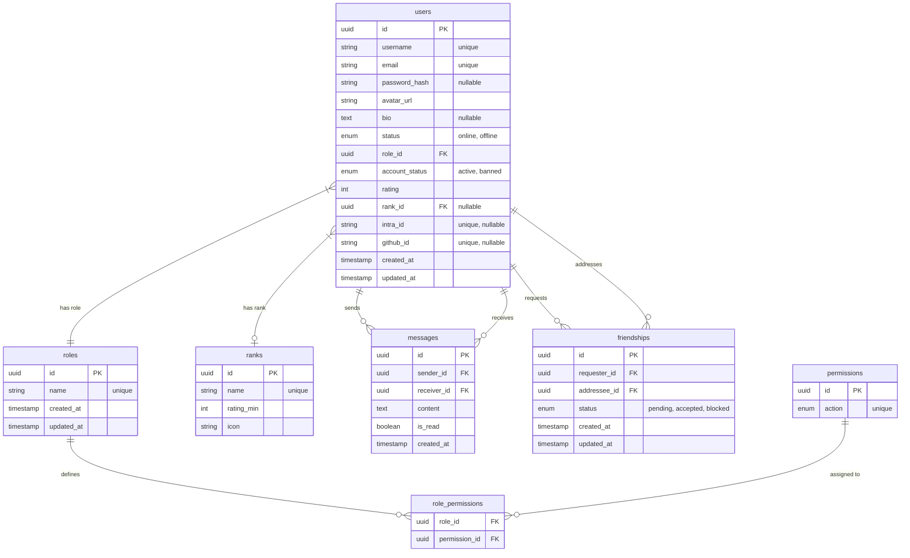

# Database Schema

This document describes the persistent data model for Chadscendence.

## Entity-Relationship Diagram

## Transient Data (Non-DB)

The following models exist in the application but are **not** persisted in the primary PostgreSQL database:

- **Rooms:** Managed in-memory within the `RoomsService`.
- **Active Games:** Managed in Redis for real-time performance.
